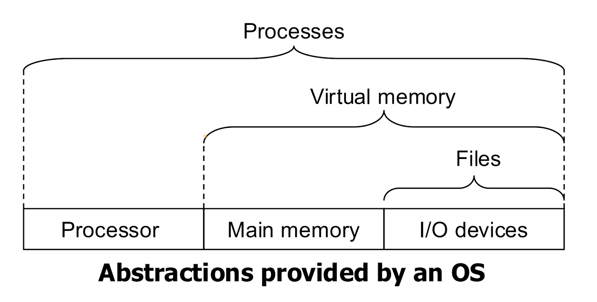

# 코드 및 시스템 최적화 개요

-   교수: 최린 교수님
-   조교: 윤동근(hmhmind314@korea.ac.kr)
-   강의실: 신공학관 B103호
-   강의 시간: 목 10:30 ~ 13:15
-   학점: 3학점
-   

### 과제
- 풀어서 내기만 하면 됨.
- 다 못풀어도 됨.
- copy 여부만 확인할 것.

## Overview

### Course Contents

1. OS Overview
2. Process
3. Thread
4. Mutual Exclusion and Synchronization
5. Deadlock and Starvation
6. Memory Management
7. Virtual Memory
8. Uniprocessor Scheduling
9. Multiprocessor and Realtime Scheduling
10. IO
11. File Management
12. Virtual Machine

## Evaluation

-   **Midterm:** 35%
-   **Final:** 35%
-   **Homework and Projects:** 30%
-   **Class participation:** extra 5%
    -   **Attendance:** no shows of more than 2 will get -5%
    -   **Bonus points**

## 특징
- 슬라이드에서 분홍색으로 된 제목: 교수님이 직접 추가하신 내용
- 파란색: 텍스트북 기반

---
### 컴퓨터란?
-   컴퓨터는 **프로그램**을 실행하는 기계
-   컴퓨터는 conventional이 아닌, sequential하게 동작함
-   컴퓨터는 Prosessor이라고 하는, 명령어를 해석하고 실행하는 장치가 있음
-   프로그램: a sequence of instructions with data.
-   메모리에는 static한 공간, dynamic한 공간이 있음
    -   static: code, global variables
    -   dynamic: stack, heap
-   32bit, 64bit 프로세서의 차이?
    -   연산의 단위(data 크기)가 32bit, 64bit
    -   주소 지정의 단위가 32bit, 64bit

### Program vs Process
-   Program: a sequence of instructions with data
-   Process: a program in execution
-   Process는 프로세서에 의해 실행되는 프로그램의 인스턴스(실행 중인 프로그램)

    

