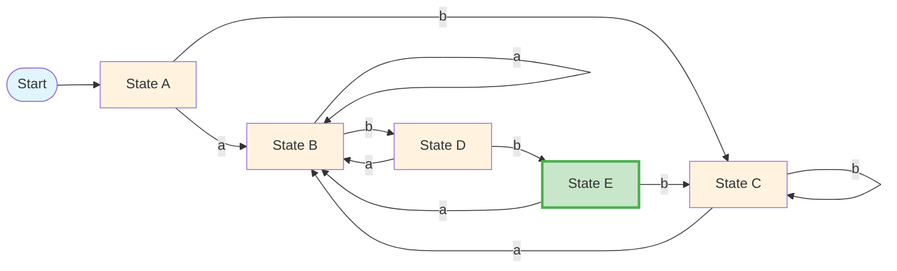

## 일반적인 토큰

-   키워드와 연산자
    -   `if`, `else`, `while`, `return`, `int`, `float` 등
    -   `+`, `-`, `*`, `/`, `=`, `==`, `<`, `>` 등
-   주석
    -   한 줄 주석 (예: `// 이것은 주석입니다`)
    -   여러 줄 주석 (예: `/* 이것은 여러 줄 주석입니다 */`)
-   식별자
    -   변수명 (예: `x`, `total`, `index`)
    -   함수명 (예: `main`, `calculateSum`)
    -   클래스명 (예: `MyClass`, `DataProcessor`)
-   숫자
    -   정수 (예: `42`, `-7`)
    -   부동소수점 (예: `3.14`, `-0.001`)
    -   복소수 (예: `2 + 3i`)
-   공백
    -   토큰을 구분하지만 언어 구문의 일부가 아닌 공백, 탭, 줄바꿈

## 단어 인식

-   상태 기계를 사용한다.

```
s1 -> s2 -> s3 -> accept
```

-   각 상태는 입력 문자열의 조건을 나타낸다.

### 정규 언어

-   정규 언어는 정규 표현식으로 설명되거나 유한 상태 오토마타(FSA)로 인식될 수 있는 문자열의 집합이다.
-   **정의**: 유한 상태 오토마타(FSA)로 인식할 수 있는 형식 언어
-   **특징**:
    -   메모리 제한: 유한한 상태만 기억할 수 있음
    -   단순한 패턴: 복잡한 중첩 구조를 표현할 수 없음
    -   효율적 처리: 선형 시간에 패턴 매칭 가능
-   **예시**:
    -   `a*` (a가 0개 이상)
    -   `(ab)*` ("ab"가 0번 이상 반복)
    -   `a+b+` (a가 1개 이상, 그 다음 b가 1개 이상)
-   **한계**: 균형 잡힌 괄호, 회문, 복잡한 중첩 구조를 표현할 수 없음

### 정규 표현식

-   **정의**: 정규 언어를 설명하는 수학적 표기법
-   **기본 연산**:
    1. **연결**: `ab` (a 다음에 b)
    2. **합집합**: `a|b` (a 또는 b)
    3. **클레이니 스타**: `a*` (a가 0개 이상)
-   **확장된 연산자**:
    -   `+`: 1개 이상 (`a+` = `aa*`)
    -   `?`: 0개 또는 1개 (`a?` = `a|ε`)
    -   `[abc]`: 문자 클래스 (a, b, c 중 하나)
    -   `[a-z]`: 범위 (a부터 z까지)
    -   `^`: 문자열 시작
    -   `$`: 문자열 끝
-   **예시**:
    -   이메일: `^[a-zA-Z0-9._%+-]+@[a-zA-Z0-9.-]+\.[a-zA-Z]{2,}$`
    -   전화번호: `^\d{3}-\d{4}-\d{4}$`
    -   숫자: `^\d+$`

### 유한 상태 오토마타 (FSA)

#### DFA (결정적 유한 오토마타)

-   **정의**: DFA = (Q, Σ, δ, q₀, F)
    -   Q: 상태들의 집합
    -   Σ: 입력 알파벳
    -   δ: 전이 함수 (Q × Σ → Q)
    -   q₀: 시작 상태
    -   F: 최종 상태들의 집합
-   **특징**:
    -   **결정적**: 각 입력 심볼에 대해 정확히 하나의 다음 상태
    -   **유일한 경로**: 입력이 유일한 실행 경로를 결정
    -   **ε-전이 없음**: 입력 없이는 전이 불가능
-   **장점**:
    -   간단한 구현 (테이블 룩업)
    -   예측 가능한 동작
    -   하드웨어 친화적

#### NFA (비결정적 유한 오토마타)

-   **정의**: NFA = (Q, Σ, δ, q₀, F)
    -   Q: 상태들의 집합
    -   Σ: 입력 알파벳 ∪ {ε}
    -   δ: 전이 함수 (Q × (Σ ∪ {ε}) → P(Q))
    -   q₀: 시작 상태
    -   F: 최종 상태들의 집합
-   **특징**:
    -   **비결정적**: 각 입력에 대해 0개 이상의 다음 상태
    -   **여러 경로**: 같은 입력이 여러 실행 경로로 이어질 수 있음
    -   **ε-전이**: 입력 없이도 전이 가능
-   **장점**:
    -   복잡한 패턴에 대한 직관적 설계
    -   간결한 표현 (동등한 DFA보다 적은 상태)
    -   정규 표현식과 직접 대응

#### DFA vs NFA 비교

| 특징       | DFA                     | NFA                  |
| ---------- | ----------------------- | -------------------- |
| **전이**   | 정확히 하나의 다음 상태 | 0개 이상의 다음 상태 |
| **ε-전이** | 불가능                  | 가능                 |
| **실행**   | 유일한 경로             | 여러 경로 가능       |
| **구현**   | 간단                    | 복잡 (백트래킹 필요) |
| **메모리** | O(1)                    | O(n) (경로 추적)     |

#### 동등성 정리

-   **중요**: DFA와 NFA는 동등한 표현력을 가짐
-   모든 NFA에 대해 동등한 DFA가 존재
-   모든 DFA는 NFA의 특수한 경우
-   **변환**: 부분집합 구성법을 사용하여 NFA → DFA 변환

### 컴파일러 응용

1. **정규 표현식** → **NFA** (톰슨 알고리즘)
2. **NFA** → **DFA** (부분집합 구성법)
3. **DFA 최소화** (상태 수 감소)
4. **코드 생성** (테이블 기반 스캐너)

이 과정을 통해 정규 표현식으로 정의된 토큰들을 효율적으로 인식할 수 있는 스캐너를 생성한다.

### Recognizer

-   입력 문자열이 특정 언어에 속하는지 결정하는 장치
-   RE를 통해 DFA 또는 NFA 생성
-   플로우:

```
RE -> NFA -> DFA -> Minimized DFA -> Recognizer
```

-   NFA는 parallel하게 여러 상태를 추적할 수 있지만, DFA는 단일 상태만 추적

### (a|b)\*abb 예시

-   RE: (a|b)\*abb
-   필기 참고

## NFA to DFA

### States for (a|b)\*abb

-   A = {0,1,2,4,7}
-   B = {1,2,3,4,6,7,8}
-   C = {1,2,4,5,6,7}
-   D = {1,2,4,5,6,7,9}
-   E = {1,2,4,5,6,7,10}

### Transition Table

| State | a   | b   |
| ----- | --- | --- |
| A     | B   | C   |
| B     | B   | D   |
| C     | B   | C   |
| D     | B   | E   |
| E     | B   | C   |

### DFA Diagram



### DFA 최소화 예시

#### 모든 상태 쌍

-   (A,B), (A,C), (A,D), (A,E)
-   (B,C), (B,D), (B,E)
-   (C,D), (C,E)
-   (D,E)
-   총 10개의 고유한 상태 쌍

#### 동등하지 않은 상태 (Inequivalent states)

-   **(A,E), (B,E), (C,E), (D,E)**: E는 수락 상태이므로 다른 모든 상태와 동등하지 않음
-   **(A,D), (C,D), (E,D)**: 'b' 입력 시 `각각` (C,E)로 전이하여 동등하지 않음
-   **(B,D)**: 'b' 입력 시 (D,E)로 전이하여 동등하지 않음
-   **(A,B), (C,B), (E,B)**: 'b' 입력 시 (C,D)로 전이하여 동등하지 않음

#### 동등한 상태 (Equivalent states)

-   **(A,C)**: 두 상태 모두 'a' 입력 시 B로, 'b' 입력 시 C로 전이
-   동일한 전이 행동을 보이므로 하나의 상태로 병합 가능

#### 결론

-   **답: 아니오, 이 DFA는 최소가 아닙니다**
-   상태 A와 C가 동등하므로 병합 가능
-   최소화된 DFA는 4개의 상태를 가질 수 있음

## Grammars for RE

### 정규 표현식과 문법의 관계

-   **정리**: 임의의 정규 표현식 r에 대해, L(r) = L(g)를 만족하는 문법 g가 존재한다.

    -   모든 정규 표현식은 동등한 문법으로 변환 가능
    -   정규 표현식이 생성하는 언어와 문법이 생성하는 언어가 일치
        -   `언어: 특정 규칙에 따라 구성된 문자열의 집합`

-   **정규 문법의 정의**: 정규 집합(regular sets)을 생성하는 문법을 정규 문법(regular grammars)이라고 한다.

### 정규 문법의 정의

정규 문법에서는 모든 생성 규칙(productions)이 다음 두 가지 형태 중 하나를 가진다:

1. **A → aA** (비단말 기호가 오른쪽 끝에 위치)
2. **A → a** (단말 기호로 끝남)

여기서:

-   **A**: 비단말 기호(nonterminal)
-   **a**: 단말 기호(terminal)

### 정규 문법의 특징

-   **제한된 형태**: 생성 규칙이 매우 제한적
-   **선형 구조**: 중첩된 구조를 표현할 수 없음
-   **정규 언어**: 정규 문법으로 생성되는 언어는 정규 언어
-   **DFA 변환**: 정규 문법은 DFA로 쉽게 변환 가능

### 예시

정규 표현식 `(a|b)*abb`에 대한 정규 문법:

```
S → aS | bS | aA
A → bB
B → bC
C → ε
```

이 문법은 `(a|b)*abb`와 동일한 언어를 생성한다.

## 정규 언어의 한계

### 모든 언어가 정규 언어는 아니다!

-   **정규 표현식의 한계**: 정규 표현식(RE)은 균형 잡히거나 중첩된 구조를 설명하는 데 사용될 수 없습니다.

    -   예: 균형 잡힌 괄호 문자열의 모든 집합은 RE로 설명할 수 없습니다.
    -   이러한 언어는 문맥 자유 문법(context-free grammar)으로 지정할 수 있습니다.

-   **DFA로 인식할 수 없는 언어들**:

    -   `L = {p^k q^k}` (임의의 k에 대해)
        -   p와 q의 개수가 같은 문자열 (예: pq, ppqq, pppqqq, ...)
    -   `L = {wcw^r | w ∈ Σ*}`
        -   w + c + w의 역순 형태 (예: abcacba, xyzczyx, ...)

-   **정규 표현식이 표현할 수 있는 것**:
    -   주어진 구성 요소의 고정된 반복 횟수
    -   지정되지 않은 반복 횟수 (0개 이상, 1개 이상)
    -   예시:
        -   `(ε|1)(01)*(ε|0)`
        -   `(01|10)+`

### 정규 언어의 특징 요약

-   **메모리 제한**: 유한한 상태만 기억할 수 있음
-   **선형 패턴**: 복잡한 중첩 구조를 표현할 수 없음
-   **효율적 처리**: 선형 시간에 패턴 매칭 가능
-   **컴파일러 응용**: 토큰 인식에 적합

## 이론 vs 실제: 스캐너 설계의 현실

### 이론적으로는 간단하지만...

**이론**: `RE → NFA → DFA → 스캐너` (단순한 파이프라인)

**실제로는 복잡한 문제들**:

1. **예약어 문제**

    - PL/1: 예약어가 없어서 `then`, `else`도 변수명으로 사용 가능
    - 스캐너가 키워드와 식별자를 구분하기 어려움

2. **공백 처리 문제**

    - Fortran: 공백을 무시 → `Do 10 I = 1.25`가 `Do10I`로 해석될 수 있음
    - 언어마다 공백 처리 방식이 다름

3. **문자열 상수 문제**

    - 따옴표 안의 이스케이프 시퀀스, 중첩된 따옴표 처리
    - 정규 표현식만으로는 복잡한 문자열 구조 처리 한계

4. **유한 클로저 문제**
    - `R^i` (R이 i번 반복) 같은 제한된 반복 패턴
    - 이론적으로는 가능하지만 실제 구현에서는 복잡

### 핵심 포인트

-   **이론**: 정규 표현식으로 토큰 패턴 정의 → DFA로 인식
-   **현실**: 언어별 특수 규칙들이 이론적 접근을 복잡하게 만듦
-   **결론**: 스캐너 설계는 이론적 지식 + 언어별 특성 이해가 모두 필요
