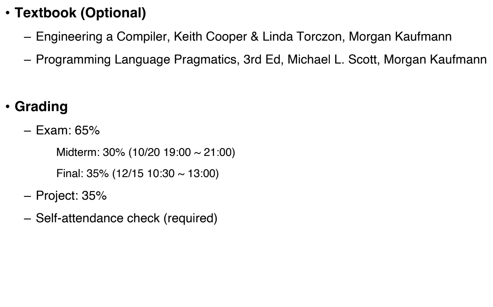

# 코드 및 시스템 최적화 개요
- 교수: 김선욱 교수님
- 조교: 김인서(kiminse123@korea.ac.kr)
- 강의실: 신공학관 B114호
- 강의 시간: 월, 수 10:30 - 11:45
- 학점: 3학점

## OT

    

## Projects
- Scanner (15%)
  - Lex(Lexical analyzer)을 이용한 Scanner 구현
- Context-free Parser (15%)
  - Yacc(Yet Another Compiler Compiler)를 이용한 Parser 구현
- Context-sensitive Parser (15%)
  - Project 2를 이용한 Parser 구현
- ISA 확장 (25%)
  - RISC-V ISA 확장 컴파일러 코드 생성 및 성능 분석
- LLM (25%)
  - Linear Algebra with Optimization

## 왜 우리는 컴파일러를 배우는가?
- Compilers include many applications of theory to practice
  - 현대에 우리가 배우는 거의 모든 알고리즘이 들어간다.
  - 그러므로, SW 개발자에게 매우 유용하다.
- Many practical applications have embedded languages
    - 프로그래밍 언어에 대해 더 깊이 이해할 수 있다.
- Writing a compiler exposes practical algorithmic & engineering issues
- 예시를 들면, 포인터를 썼을 때, 코드의 재사용성은 높아지지만, 컴파일러가 최적화를 하기 힘들어지는 등의 **trade-off**가 존재한다.

